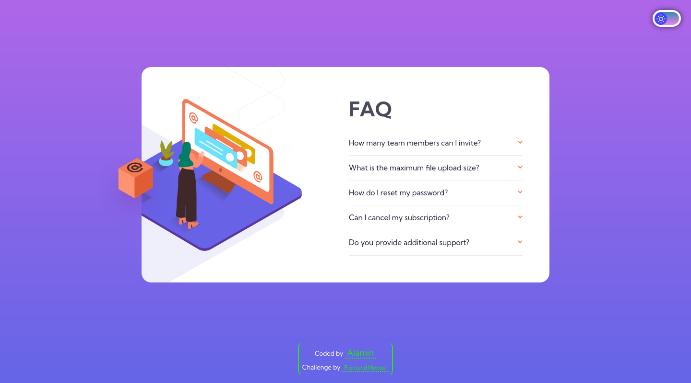

<h1 align="center">FAQ accordion card</h1>

<div align="center">
  <h3>
    <a href="https://faq-accordion-card-alamin.netlify.app/">
      🚀 Live Site
    </a>
    |
    <a href="">
      💡 Solution
    </a>
  </h5>
</div>

<p align="center">
  This is a responsive and interactive FAQ card project that I completed as a solution to the FAQ Accordion Card challenge from Frontend Mentor. The project is built with HTML, CSS, and JavaScript, and allows users to expand and collapse answers to frequently asked questions.
</p>

## Screenshot

<a align="center" href="https://faq-accordion-card-alamin.netlify.app/">


</a>

## The challenge

Users should be able to:

- View the optimal layout for the component depending on their device's screen size
- See hover states for all interactive elements on the page
- Hide/Show the answer to a question when the question is clicked

## Built with

- Semantic HTML5 markup
- CSS custom properties
- JavaScript
- Mobile-first workflow
- NPM
- [Webpack](https://webpack.js.org/)

## What I learned

Through completing this project, I had the opportunity to further develop my skills in creating responsive and interactive user interfaces using HTML, CSS, and JavaScript.

Specifically, I learned how to use the max-height property in CSS to create smooth and animated transitions when expanding and collapsing elements on the page, by setting it to the element's scrollHeight property.

I also practiced my JavaScript skills, particularly in terms of manipulating the DOM and responding to user events.

Overall, this project challenged me to think creatively and problem-solve in order to create a functional and aesthetically pleasing FAQ accordion card.

## Installation

- Clone this repo:

```sh
git clone https://github.com/CodePapa360/FAQ-accordion-card.git
```

- Install dependencies:

```sh
npm install
```

- Build command:

```sh
npm run build
```

## Author

<b>👤 Alamin</b>

- Twitter - [@CodePapa360](https://www.twitter.com/CodePapa360)
- LinkedIn - [@CodePapa360](https://www.linkedin.com/in/codepapa360)
- Frontend Mentor - [@CodePapa360](https://www.frontendmentor.io/profile/CodePapa360)
- Github: [@CodePapa360](https://github.com/codepapa360)

Feel free to contact me with any questions or feedback!

## Show your support

Give a ⭐️ if you liked this project!

## Acknowledgments

I would like to express my gratitude to Frontend Mentor for providing this project idea and design. Their platform is an excellent resource for web developers looking to improve their skills.

## License

This project is licensed under the [MIT](https://github.com/CodePapa360/FAQ-accordion-card/blob/main/LICENSE.md) license, which means you can use, modify, and distribute the code as you wish. If you have any questions or feedback, feel free to reach out. Thank you for considering my code!
